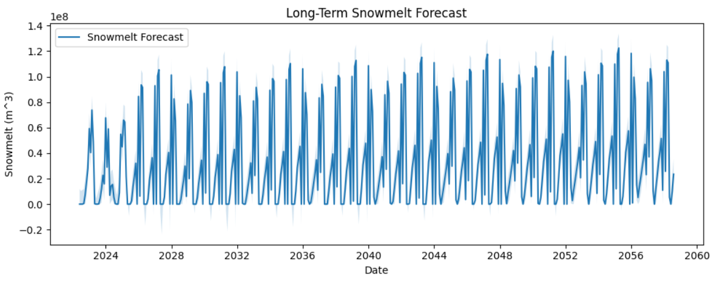
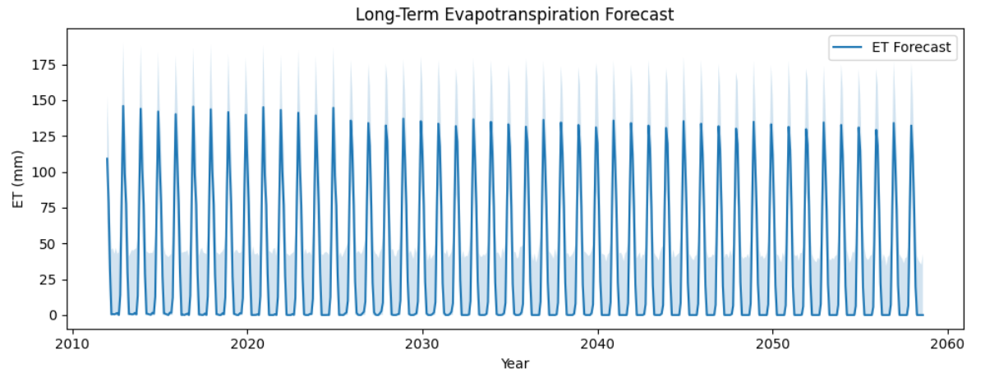
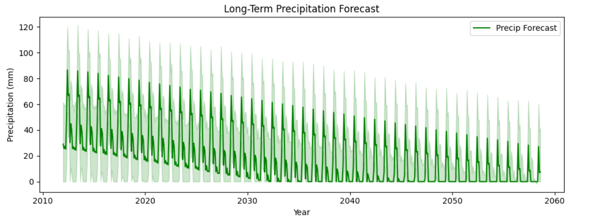

# Water Budget Predictions for Wetland Engineering in Beaverlodge, Alberta

## Project Overview

This repository contains Python scripts for forecasting key water budget components using time series analysis. The project focuses on predicting snowmelt, precipitation, and evapotranspiration using the Prophet forecasting library, which is particularly effective for time series data with strong seasonal patterns.

The analysis uses climate data from Government of Canada climate data for Beaverlodge, Alberta. Specifically, the total snow and total precipitation records, to inform and validate the calculations. Understanding these components is critical for the design, restoration, and management of engineered wetlands, as accurate water budgeting dictates wetland viability, habitat conditions, and flood mitigation.

## Prerequisites

- Python 3.7+
- Required Python packages:
  - pandas
  - prophet
  - matplotlib
  - openpyxl (for Excel file handling)

## Installation

1. Clone this repository:
   ```bash
   git clone [your-repository-url]
   cd water_budget_predictions-main
   ```

2. Install the required packages:
   ```bash
   pip install pandas prophet matplotlib openpyxl
   ```

NOTE: You can run the files in this repository using platforms such as Visual Studio Code, GitHub CodeSpaces, and Google Colab
## Project Structure

- `snowmelt_estimates.py` - Forecasts snowmelt volumes over long-term periods.
- `evapotranspiration_and_precipitation estimates.py` - Forecasts evapotranspiration (ET) and precipitation over long-term periods
- `Input Data for Water Budget Predictions.xlsm` - Input data file (not included in repository)
- `Monthly_Snowmelt_Predictions.xlsx` - Generated snowmelt forecasts
- `Monthly_ET_and_Precip_Predictions.xlsx` - Generated ET and precipitation forecasts

## Usage

### 1. Snowmelt Forecasting

**File:** `snowmelt_estimates.py`

**Purpose:**  
Generates long-term forecasts of snowmelt volumes (in m³/month) using Facebook's Prophet time series forecasting model.

**Input Data:**
- Excel file: `Input Data for Water Budget Predictions.xlsm`
- Sheet name: 'Snowmelt'
- Required columns:
  - 'Month-Year': Date in YYYY-MM or MMM-YYYY format
  - 'Sum of Volumetric Snowmelt Per Month (m^3/month)': Numeric values

**Output:**
- Excel file: `Monthly_Snowmelt_Predictions.xlsx`
- Graph: `snowmelt_forecast.png` (placeholder)

**Example Output Graph:**
<!-- INSERT SNOWMELT_FORECAST.PNG HERE -->


### 2. Evapotranspiration and Precipitation Forecasting

**File:** `evapotranspiration_and_precipitation estimates.py`

**Purpose:**  
Generates separate long-term forecasts for evapotranspiration (ET) and precipitation using Prophet.

**Input Data:**
- Excel file: `Input Data for Water Budget Predictions.xlsm`
- Sheet name: 'ET_and_Precip'
- Required columns:
  - 'Month-Year': Date in YYYY-MM or MMM-YYYY format
  - 'Monthly Evapotranspiration Estimates (ET) (mm)'
  - 'Monthly Precipitation Estimates (mm)'

**Output:**
- Excel file: `Monthly_ET_and_Precip_Predictions.xlsx`
- Graph 1: `et_forecast.png` (placeholder)
- Graph 2: `precip_forecast.png` (placeholder)

**Example Output Graphs:**
<!-- INSERT ET_FORECAST.PNG HERE -->


<!-- INSERT PRECIP_FORECAST.PNG HERE -->


## How It Works

Both scripts use Facebook's Prophet library, which is designed for forecasting time series data with daily observations that display patterns on different time scales (yearly, weekly, etc.). The models:

1. Automatically detect changepoints in the time series
2. Handle missing data and outliers
3. Provide uncertainty intervals
4. Include built-in cross-validation

## Customization

You can modify these parameters in the scripts:
- `months_to_predict`: Number of months to forecast into the future (default: 400)
- Input/output file paths
- Plot styling and figure sizes

## Dependencies

- pandas >= 1.3.0
- prophet >= 1.0.0
- matplotlib >= 3.4.0
- openpyxl >= 3.0.0

## License

[Specify your license here, e.g., MIT, GPL, etc.]

## Contributing

Contributions are welcome! Please feel free to submit a Pull Request.

## Contact

[Your Name/Organization]  
[Your Email]  
[Project URL]

## Acknowledgments

- Facebook's Prophet team for the forecasting library
- Environment Canada for climate data
